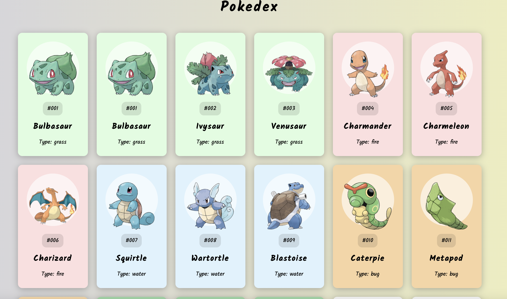

## Pokedex

> Build a pokemon cards on vanilla js

### [Demo](https://pokedex-ab.surge.sh)
[](https://radikal.ru/video/GQ5HEFc1Jgz)

### Get started

```shell script
git clone
```
```shell script
open index.html
```
or
```shell script
npm i -g live-server
```
```shell script
live-server
```
